# WaypointFlow — Architecture & Data Model

> **Tech-Triathlon 2026 · Hackathon deliverable** · Team: Coffee to Code · Repo: `CoffetoCode_WaypointFlow`
>
> This document shows the main components of the system, its architecture, and how it stores and connects its data.
> All diagrams are [Mermaid](https://mermaid.js.org/) and render natively on GitHub.

[](https://nodejs.org)
[](https://expressjs.com)
[](https://react.dev)
[](https://vitejs.dev)
[](https://www.mongodb.com)
[](https://socket.io)

---

## Contents
1. [System overview](#1-system-overview)
2. [Architecture diagram](#2-architecture-diagram)
3. [Component responsibilities](#3-component-responsibilities)
4. [Data model](#4-data-model)
   - 4.1 [Operational core (order to receipt)](#41-operational-core-order-to-receipt)
   - 4.2 [Supporting collections](#42-supporting-collections)
   - 4.3 [Inventory and replenishment](#43-inventory-and-replenishment)
5. [Collection reference](#5-collection-reference)
6. [Lifecycle state machines](#6-lifecycle-state-machines)
7. [End-to-end data flow](#7-end-to-end-data-flow)
8. [Offline-first design and sync](#8-offline-first-design-and-sync)
9. [Real-time events](#9-real-time-events)
10. [Planning and allocation engine](#10-planning-and-allocation-engine)
11. [Security model](#11-security-model)
12. [Shared datasets to data model mapping](#12-shared-datasets-to-data-model-mapping)
13. [Deployment topologies](#13-deployment-topologies)
14. [Known limitations and roadmap](#14-known-limitations-and-roadmap)
15. [End-to-End System Proof-Testing Guide](#15-end-to-end-system-proof-testing-guide)
    - 15.1 [System Credentials & Role Workspaces](#151-system-credentials--role-workspaces)
    - 15.2 [Complete End-to-End Operational Lifecycle](#152-complete-end-to-end-operational-lifecycle)
    - 15.3 [Step-by-Step Proof-Testing Script](#153-step-by-step-proof-testing-script)
    - 15.4 [Pre-Push Validation Checklist & Expected Invariants](#154-pre-push-validation-checklist--expected-invariants)
16. [Quickstart & Demo Accounts](#16-quickstart--demo-accounts)

---

## 1. System overview
WaypointFlow connects ordering, planning, loading, delivery and receipt across the four roles in the brief
(**Store Manager**, **Dispatcher**, **Loader**, **Driver**), plus an **Admin** workspace for master data.

| Layer | Technology |
| :--- | :--- |
| **Frontend** | React 18, Vite, React Router v6, Axios, Leaflet (maps), `idb` (IndexedDB), Socket.IO client |
| **Backend** | Node.js 20, Express 4, Mongoose 8, Zod, JWT + bcryptjs, Multer, Socket.IO |
| **Database** | MongoDB (local container via Docker, or MongoDB Atlas when deployed) |
| **File storage** | Supabase Storage for POD photos, signatures and evidence, with a base64 fallback |
| **Tests / CI** | Jest + Supertest; GitHub Actions (PR build check, Stage-to-main merge) |

### Design principles that shape the architecture:
- **One shared source of truth:** All four roles read and write the same MongoDB collections through one REST API. A dispatcher decision becomes loader work; a driver record becomes store-manager information.
- **Constraints are enforced on the server:** The 10-rule engine runs in the API, so a plan that fails validation cannot be published.
- **Offline is a first-class path for drivers:** Writes are captured locally and replayed idempotently.
- **Every important decision leaves a record:** Deferrals, assignments, shortfalls and sync conflicts are persisted and audit-logged.

---

## 2. Architecture diagram

### Visual System Architecture
<div align="center">
  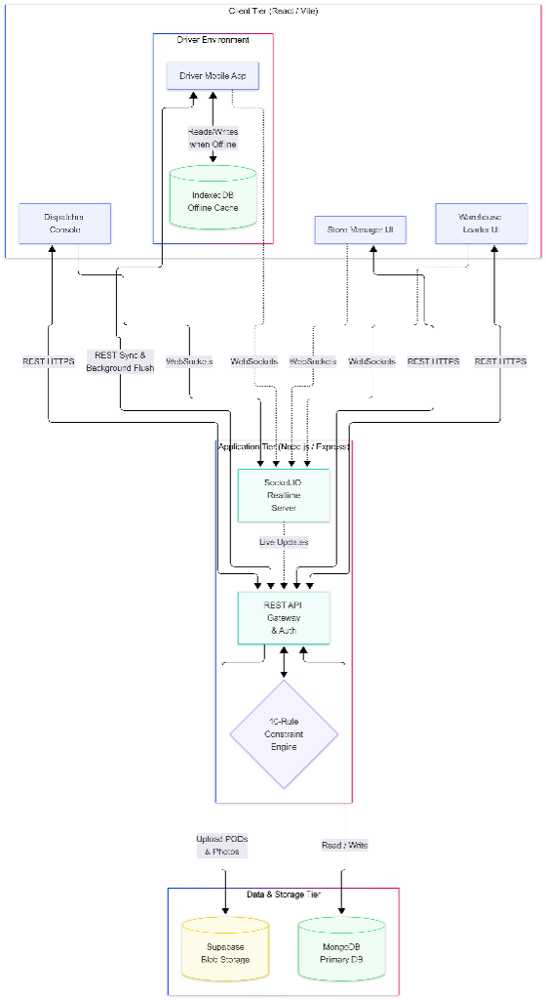
</div>

### Interactive Flow Architecture

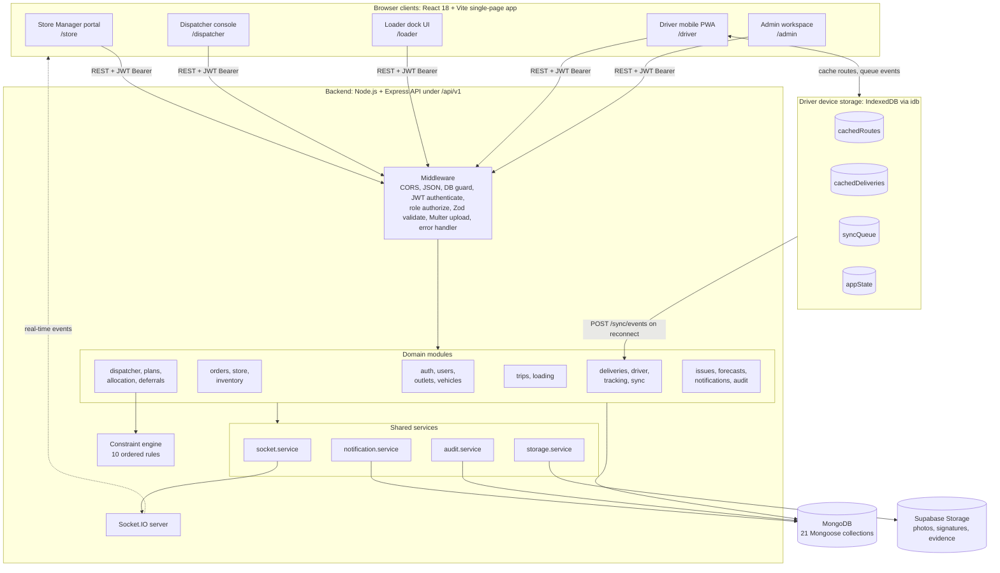

### Reading the diagram
- **Solid arrows** are request/response traffic. **Dashed arrow** is server-push over WebSocket.
- The **Driver PWA** is the only client with a local database. When connectivity drops it keeps working against IndexedDB and replays queued events through `/api/v1/sync/events` when the connection returns.
- **Domain modules** never write to storage or sockets directly; they go through the shared services, so audit logging, notifications and real-time fan-out stay consistent.

---

## 3. Component responsibilities

### Frontend (`frontend/src`)
| Area | Path | Responsibility |
| :--- | :--- | :--- |
| **Role workspaces** | `pages/store`, `pages/dispatcher`, `pages/loader`, `pages/driver`, `pages/admin` | One route tree and layout per role (`layouts/*Layout.jsx`) |
| **Route guards** | `routes/ProtectedRoute.jsx`, `routes/RoleRoute.jsx` | Block unauthenticated users and wrong-role access |
| **API clients** | `api/*.api.js`, `api/axios.js` | One thin module per backend resource; Axios instance attaches the JWT |
| **Auth and realtime** | `context/AuthContext.jsx`, `context/SocketContext.jsx`, `hooks/useSocket.js` | Session state, role redirect, live event subscription |
| **Offline layer** | `offline/db.js`, `syncQueue.js`, `syncManager.js`, `conflictResolver.js`, `hooks/useOffline.js`, `useSyncQueue.js` | IndexedDB stores, event queue, flush on reconnect, conflict merge |
| **Shared UI** | `components/common`, `components/navigation` | Design-system primitives (Button, Badge, Table, Modal) and role navigation |
| **Feature components** | `components/planning`, `loading`, `driver`, `tracking`, `order` | Trip builder, assignment modal, constraint alerts, LIFO checklist, POD form, live map |

### Backend (`backend/src`)
| Area | Path | Responsibility |
| :--- | :--- | :--- |
| **Entry points** | `server.js`, `app.js`, `api/index.js` | `server.js` runs Express + Socket.IO (Docker/local). `api/index.js` is the serverless entry for Vercel |
| **Routing** | `routes/index.js` | Mounts 21 module routers under `/api/v1` |
| **Modules** | `modules/<name>/` | Each has `*.model.js`, `*.controller.js`, `*.routes.js` (route, controller, model per bounded context) |
| **Constraint engine** | `modules/allocation/` | `constraint.validator.js` runs `rules/*.rule.js` in a fixed order; `allocation.engine.js` finds compatible vehicles |
| **Services** | `services/` | `socket`, `notification`, `audit`, `storage` |
| **Cross-cutting** | `middlewares/`, `utils/` | JWT auth, role guard, Zod validation, Multer (memory storage), idempotency, Colombo-time helpers (4 PM cutoff) |
| **Seeds and import** | `seeds/`, `scripts/` | Seed outlets, vehicles, users and sample orders; import vehicles, outlets, forecasts |

---

## 4. Data model
MongoDB is used with Mongoose schemas. Relationships are `ObjectId` references (`ref`), with child line-items embedded where they have no life of their own.

### 4.1 Operational core (order to receipt)
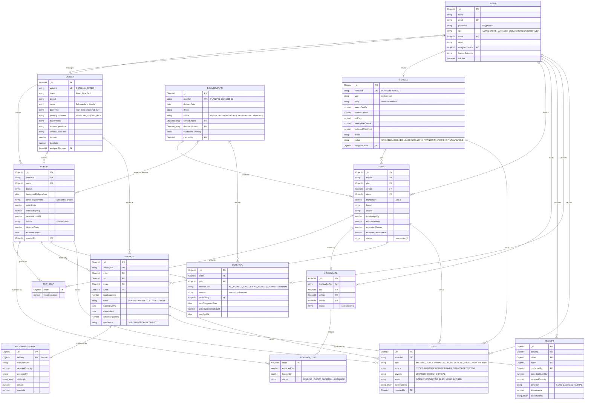

#### How to read the core model:
- `ORDER` is the unit of demand. It belongs to one `OUTLET` and carries the size (`orderUnits`, `orderWeightKg`, `orderVolumeM3`) checked against `VEHICLE` capacity.
- A `DELIVERYPLAN` is one depot-day. It owns many `TRIP`s; each trip is one vehicle run (`tripNumber` 1 or 2) for one brand and one district.
- `TRIP.orders[]` is the embedded stop list (`order` + `stopSequence`). On publish, each stop is expanded into a `DELIVERY` row.
- `LOADINGJOB` is generated per trip in reverse stop order (LIFO).
- `PROOFOFDELIVERY` (driver evidence) and `RECEIPT` (store confirmation) are deliberately separate collections so disputes can be cross-examined.
- `DEFERRAL` stores the decision, reason code, user, and suggested next run.

---

### 4.2 Supporting collections
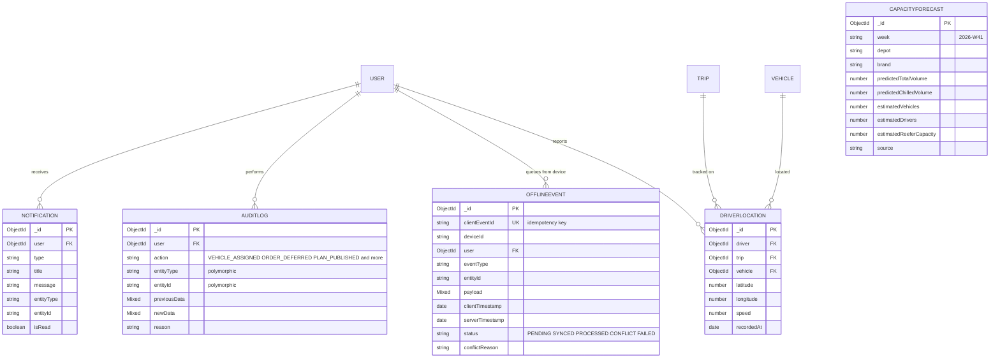
- `AUDITLOG` and `NOTIFICATION` use polymorphic `entityType` + `entityId` (string).
- `CAPACITYFORECAST` is keyed by `(week, depot, brand)` and populated by import.

---

### 4.3 Inventory and replenishment
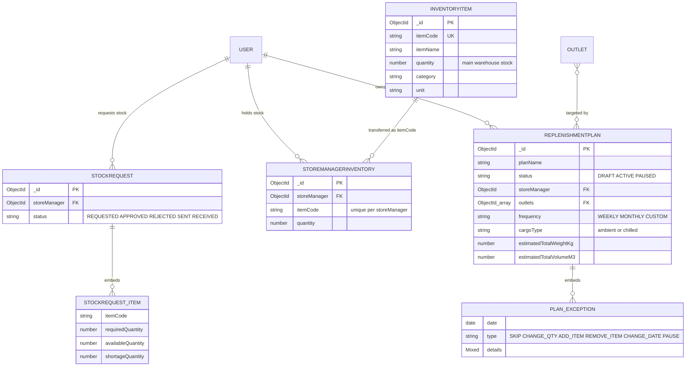
Warehouse stock (`InventoryItem`) and a store manager's local stock (`StoreManagerInventory`) are kept in separate collections so stock only moves through the `StockRequest` state machine: `REQUESTED -> APPROVED -> SENT -> RECEIVED`.

---

## 5. Collection reference

| Collection | Purpose | Notable indexes / constraints |
| :--- | :--- | :--- |
| `User` | Accounts for all five roles; links to outlet, depot, assigned vehicle | `email` unique |
| `Outlet` | The 120 outlets: brand, district, depot, dock, access and delivery windows | `outletId` unique; `{depot, brand, district}` |
| `Vehicle` | The 60 vehicles: type, temperature, capacities, fuel profile, status | `vehicleId` unique; `{depot, status, temp}` |
| `Order` | One store order (ambient or chilled) with size and lifecycle status | `orderRef` unique; `{requestedDeliveryDate, status}`; `outlet`; `brand` |
| `DeliveryPlan` | One depot-day plan: served and deferred orders, validation result | `{deliveryDate, depot}`; `planRef` unique sparse |
| `Trip` | One vehicle run (1 or 2 per day), embedded ordered stops | `{vehicle, plan}`; `driver`; `status` |
| `LoadingJob` | Dock checklist for a trip, with per-item loaded status | `trip`; `vehicle`; `status`; `loadingJobRef` unique |
| `Delivery` | One stop: planned vs actual arrival, outcome, sync status | `{trip, stopSequence}`; `driver`; `order` |
| `ProofOfDelivery` | Receiver name, quantity, signature, photos, GPS | `delivery` unique (one POD per stop) |
| `Receipt` | Store-side confirmation with discrepancy and evidence | `order`; `delivery`; `outlet` |
| `Deferral` | Deferred order with mandatory reason code and next suggested run | `order`; `plan`; `deferredAt` desc |
| `Issue` | Shortfall, damage, failed delivery, breakdown, reefer failure | `{type, status}`; `trip`; `vehicle`; `order` |
| `OfflineEvent` | Server-side ledger of events replayed from devices | `clientEventId` unique; `status`; `{user, clientTimestamp}` |
| `DriverLocation` | GPS breadcrumbs for live tracking | `{driver, recordedAt}`; `{trip, recordedAt}` |
| `CapacityForecast` | Weekly volume and fleet forecast per depot and brand | `{week, depot, brand}` |
| `Notification` | In-app notice store with read API (`/notifications`) | `{user, isRead}`; `createdAt` desc |
| `AuditLog` | Immutable record of key actions with before/after data | `{entityType, entityId}`; `action`; `createdAt` desc |
| `InventoryItem`, `StoreManagerInventory`, `StockRequest`, `ReplenishmentPlan` | Stock transfer and standing replenishment | `itemCode` unique; `{storeManager, itemCode}` unique |

---

## 6. Lifecycle state machines

### Order Lifecycle
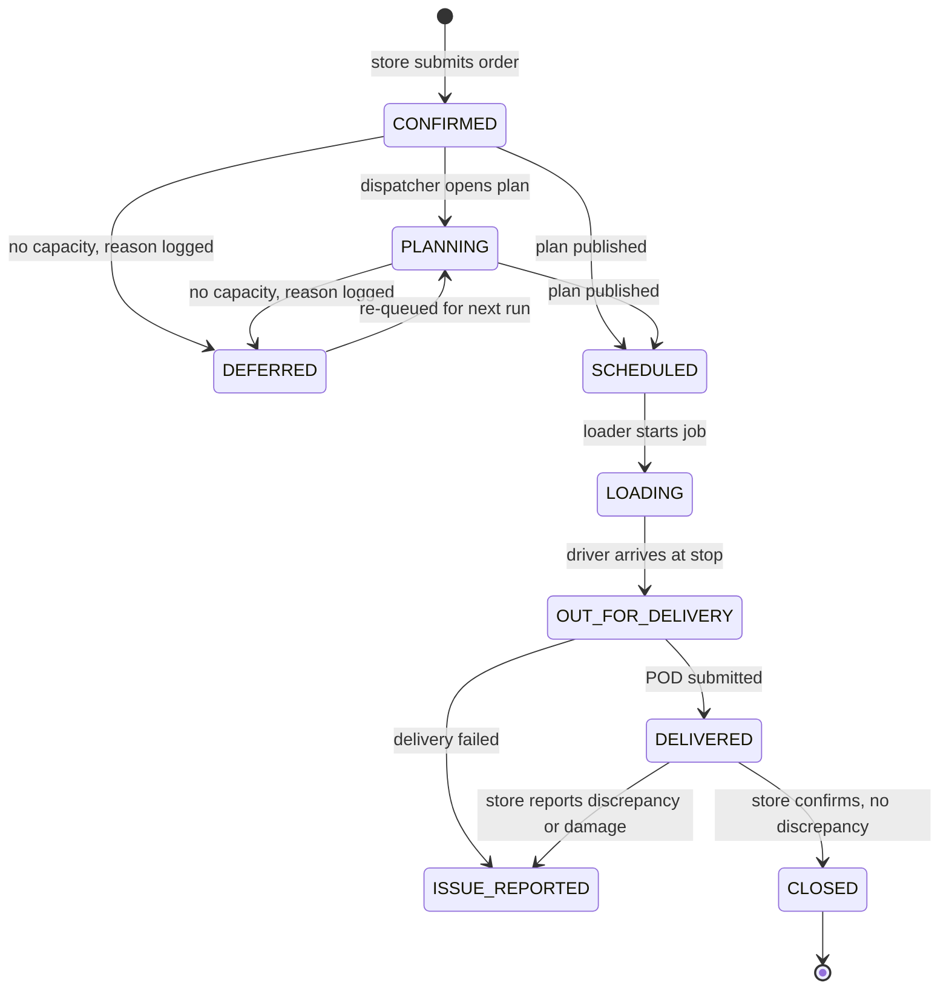

### Trip, Loading Job and Vehicle (Move Together)
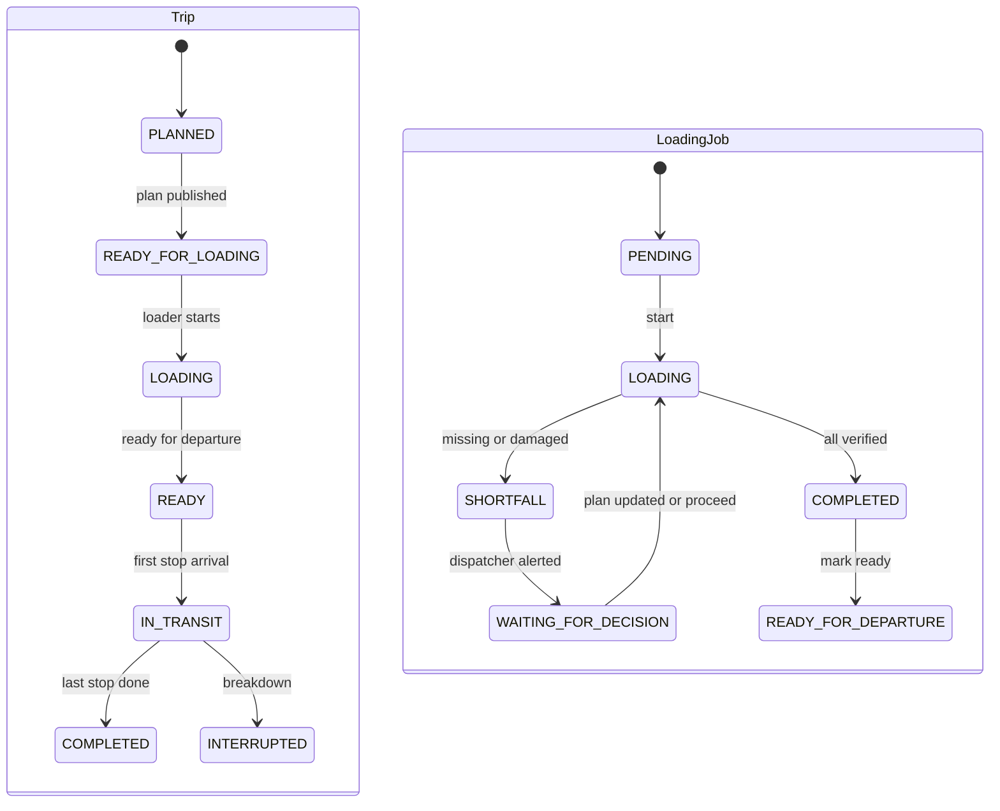

| Event | Trip | LoadingJob | Vehicle | Orders |
| :--- | :--- | :--- | :--- | :--- |
| **Plan published** | `READY_FOR_LOADING` | created, `PENDING` | `ASSIGNED` | `SCHEDULED` |
| **Loader starts** | `LOADING` | `LOADING` | `LOADING` | `LOADING` |
| **Ready for departure** | `READY` | `READY_FOR_DEPARTURE` | `READY` | unchanged |
| **First stop arrival** | `IN_TRANSIT` | unchanged | unchanged | `OUT_FOR_DELIVERY` |
| **Last stop complete** | `COMPLETED` | unchanged | `AVAILABLE` | `DELIVERED` |

---

## 7. End-to-end data flow

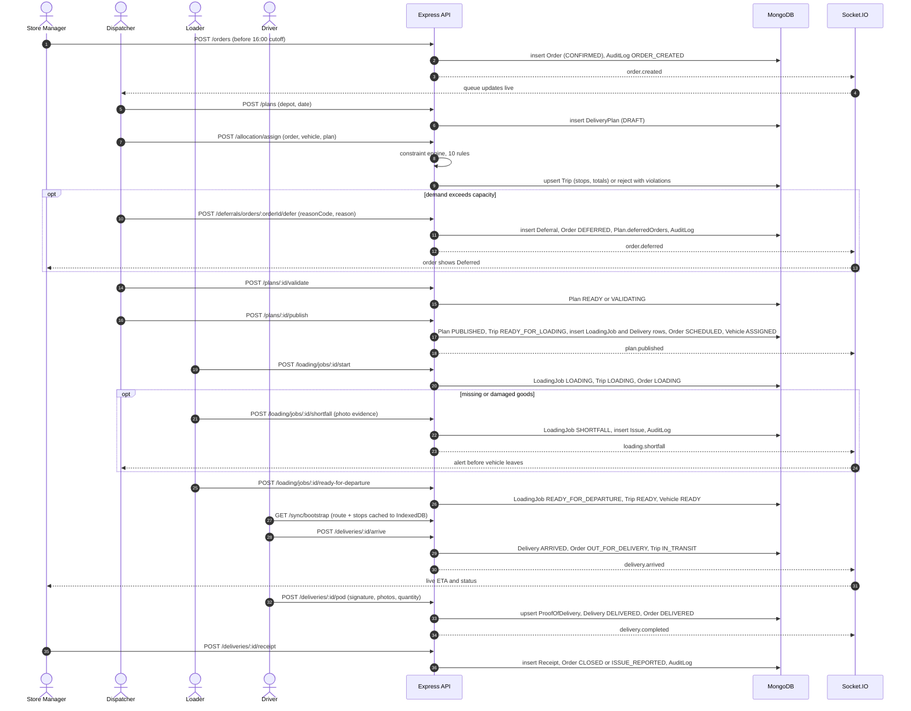

---

## 8. Offline-first design and sync

Coverage drops across hill country, the Kandy corridor and rural districts, so the driver app is built to keep working with no connection and reconcile afterwards.

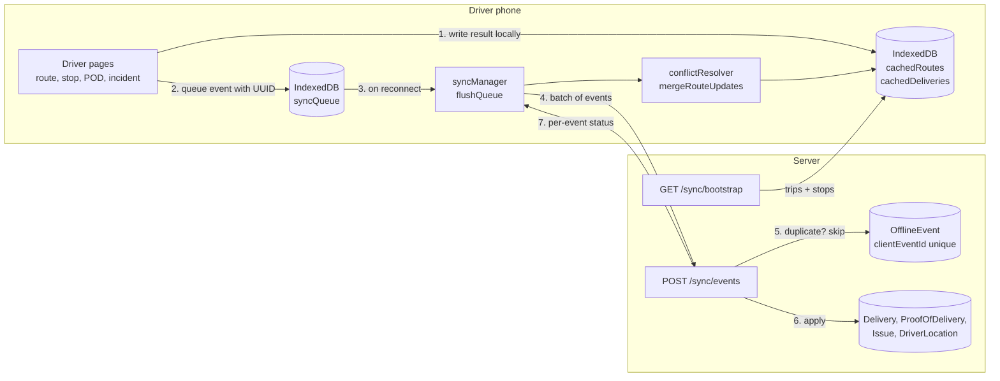

| Step | Behaviour |
| :--- | :--- |
| **Bootstrap** | `GET /sync/bootstrap` returns the driver's active trips and ordered stops (outlet details populated). They are written to `cachedRoutes` and `cachedDeliveries`. |
| **Capture** | Arrivals, deliveries, POD, incidents and GPS pings are saved locally and appended to `syncQueue`, each with a client-generated `clientEventId`, `deviceId` and `clientTimestamp`. |
| **Replay** | When `navigator.onLine` returns, `flushQueue()` posts the pending events in one batch. |
| **Idempotency** | The server checks `OfflineEvent.clientEventId` (unique). A replayed event returns its original status instead of being applied twice, so retries after a flaky connection are safe. |
| **Apply** | Supported `eventType`s: `DELIVERY_ARRIVED`, `DELIVERY_COMPLETED`, `POD_SUBMITTED`, `LOCATION_UPDATE`, `ISSUE_REPORTED`. |
| **Conflict** | If the delivery no longer exists, or was already completed online, the event is stored as `CONFLICT` with a `conflictReason`, an `OFFLINE_SYNC_CONFLICT` audit entry is written, and `sync.conflict` is emitted to the dispatcher. |
| **Merge rule** | `mergeRouteUpdates` keeps stops the driver already completed on the device and takes updated or new stops from the dispatcher's plan for everything else. Completed work is never discarded. |

---

## 9. Real-time events

`socket.service.js` wraps Socket.IO. The server supports rooms (`join_room` / `leave_room`), broadcasting to all connected clients in real-time.

| Event | Emitted when | Main consumer |
| :--- | :--- | :--- |
| `order.created` | Store submits an order | Dispatcher queue |
| `order.deferred` | Dispatcher defers an order | Store manager, dispatcher |
| `plan.published` | Plan moves to `PUBLISHED` | Loader, driver |
| `loading.started` / `loading.completed` | Loader begins / finishes a job | Dispatcher |
| `loading.shortfall` | Missing or damaged item flagged | Dispatcher |
| `trip.started` | First stop arrival on a trip | Dispatcher tracking |
| `driver.location` | GPS update | Live map |
| `delivery.arrived` / `delivery.completed` / `delivery.failed` | Stop status changes | Store manager, dispatcher |
| `vehicle.breakdown` | Driver reports a vehicle problem | Dispatcher critical alert |
| `route.updated` | Trip reassigned after a change | Driver |
| `sync.completed` / `sync.conflict` | Offline batch processed | Dispatcher |

*Note: On Vercel serverless functions, WebSockets gracefully fallback to periodic sync requests, keeping UX consistent without connection dropouts.*

---

## 10. Planning and allocation engine

`constraint.validator.js` runs ten sequential rules in a fixed order and returns every violation (not just the first), each with a code and a human-readable explanation:

| # | Rule | Source of truth | Enforces |
| :--- | :--- | :--- | :--- |
| 1 | **Availability** | `Vehicle.status` | Vehicle is not `IN_WORKSHOP` or `UNAVAILABLE` |
| 2 | **Depot** | `Vehicle.depot`, `Outlet.depot` | Vehicle serves only its own depot's outlets |
| 3 | **Temperature** | `Order.tempRequirement`, `Vehicle.temp` | Chilled orders only on `reefer` vehicles |
| 4 | **Access** | `Outlet.parkingConstraint`, `Vehicle.type` | `van_only` outlets only by `van` |
| 5 | **Brand and district** | `Trip.brand`, `Trip.district` | One brand and one district per trip |
| 6 | **Weight** | `Vehicle.weightCapKg` | Sum of order weights within the cap |
| 7 | **Volume** | `Vehicle.volumeCapM3` | Sum of order volumes within the cap |
| 8 | **Trip limit** | count of open `Trip`s per vehicle | At most two trips per vehicle per day |
| 9 | **Window** | `Outlet.windowOpenTime/CloseTime` | Planned arrival inside the outlet window |
| 10 | **Fuel** | `Vehicle.kmPerL`, `weeklyFuelQuotaL`, `fuelUsedThisWeek` | Trip fuel does not exceed the weekly quota |

---

## 11. Security model

| Concern | Mechanism |
| :--- | :--- |
| **Authentication** | `POST /auth/login` issues a JWT; `authenticate` middleware verifies the Bearer token and loads the user. Inactive users are rejected. Passwords are bcrypt-hashed. |
| **Authorization** | `authorize(...roles)` on routes and `RoleRoute` on the client. Roles: `ADMIN`, `STORE_MANAGER`, `DISPATCHER`, `LOADER`, `DRIVER`. |
| **Input validation** | Required-field and business-rule checks in controllers (for example outlet, cutoff, plan status). A Zod `validate.middleware` is provided for schema validation. |
| **Uploads** | Multer memory storage with a file-type filter; files are pushed to Supabase Storage, and only URLs are stored in MongoDB. |
| **Accountability** | `audit.service` writes `AuditLog` rows with `previousData` and `newData` for assignments, deferrals, plan publication, shortfalls, failed deliveries and sync conflicts. |
| **Configuration** | Secrets (`JWT_SECRET`, `MONGODB_URI`, Supabase keys) come from environment variables; the server logs a fatal config error if `JWT_SECRET` is missing. |

---

## 12. Shared datasets to data model mapping

| Competition file | Used in | Stored as |
| :--- | :--- | :--- |
| `outlets.csv` (120 outlets) | Seeding, planning rules, store accounts | `Outlet` (`backend/src/seeds/seedOutlets.js`, `scripts/importOutlets.js`) |
| `vehicles.csv` (60 vehicles) | Seeding, capacity, temperature, access, fuel rules | `Vehicle` (`seeds/seedVehicles.js`, `scripts/importVehicles.js`) |
| `calendar.csv` | Weekly forecast keys (ISO week) | `CapacityForecast.week` |
| Datathon Task 2A forecast output | Dispatcher capacity forecasts page | `CapacityForecast` via `POST /forecasts/import` |
| Realistic delivery day | Judge walkthrough | `Order` sample set (`seeds/seedOrders.js`) |

---

## 13. Deployment topologies

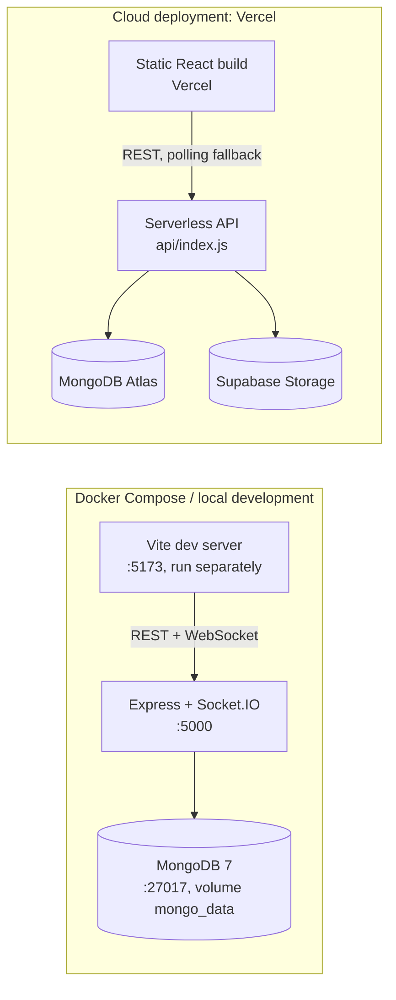

| Item | Docker Compose / local | Cloud (Vercel) |
| :--- | :--- | :--- |
| **API runtime** | `node src/server.js` (long-lived, Socket.IO on) | Serverless function via `api/index.js`; DB connection is cached across invocations |
| **Database** | `mongo:7.0` container with persistent volume | MongoDB Atlas |
| **Realtime** | Socket.IO WebSocket | Polling / periodic refresh fallback |
| **File uploads** | Supabase if keys set, otherwise base64 data URI | Supabase Storage |
| **Config** | `.env` from `.env.example` (`PORT`, `MONGODB_URI`, `JWT_SECRET`, `JWT_EXPIRES_IN`, `CLIENT_URL`, `SUPABASE_*`) | Vercel environment variables |
| **CI** | GitHub Actions: build check on PRs to `Stage`; automatic merge `Stage` to `main` | Same |

---

## 14. Known limitations and roadmap

| Area | Current state | Planned improvement |
| :--- | :--- | :--- |
| **Calendar** | `calendar.csv` is used for forecast week keys; operating days, paydays and festival ramps are not persisted as a collection | Add a `CalendarDay` collection and enforce Monday to Saturday operation in planning |
| **Fuel rule** | Uses the vehicle's weekly quota with a default 25 km trip estimate when no distance is on the trip | Compute trip distance from `district_travel.csv` and decrement `fuelUsedThisWeek` on trip completion |
| **Time budgets** | Window rule checks arrival against the outlet window; the Fresh 270-min and Style/Tech 480-min trip budgets are not a separate rule | Add a trip-time rule using `service_allowance.csv` and `district_travel.csv` |
| **Realtime scope** | Events are broadcast to all connected clients; rooms are supported but not yet used for every event | Scope events to depot and role rooms |
| **Idempotency helper** | `utils/idempotency.util.js` is an in-memory cache; the durable guarantee comes from the unique `OfflineEvent.clientEventId` index | Remove or back the helper with the database |
| **Notifications** | `Notification` model, read API and `notification.service` exist, but modules do not yet create notifications; store managers see deferrals through order status and the `order.deferred` event | Call `notification.notify()` on deferral, plan publish and delivery events |
| **Schema validation** | Zod `validate.middleware` is available but not yet attached to routes; controllers validate inline | Attach Zod schemas to write endpoints |
| **Docker Compose** | Compose defines `backend` and `mongo`; the frontend runs separately and seeding is a manual `npm run seed` | Add `frontend` and a seed step so one `docker compose up` starts everything |
| **Predictive features** | Service-time and lateness models (Datathon Task 1) are not integrated into planning, as permitted by the brief | Expose predictions as an ETA field on `Delivery` |

---

## 15. End-to-End System Proof-Testing Guide

This technical guide provides the exact step-by-step procedure to proof-test the complete multi-role Waypoint Delivery Intelligence System before committing and pushing code.

### 15.1 System Credentials & Role Workspaces

| Role | Username / Email | Password | Primary Workspace Route | Purpose |
| :--- | :--- | :--- | :--- | :--- |
| **Store Manager** | `ishani@waypoint.lk` | `12345678` | `/store/dashboard` | Inventory, stock shortage requests, replenishment plans, outlet order creation |
| **Warehouse Manager / Loader** | `loader@waypoint.lk` | `12345678` | `/loader/jobs` | Stock request approval & dispatch, vehicle packing checklists (LIFO), dock stock transfer |
| **Central Dispatcher** | `luqmandispatcher@gmail.com` | `12345678` | `/dispatcher/planning` | Auto-plan template engine, 7 constraints solver, 1-click approval, dynamic auto-reassign |
| **Driver** | `luqmandriver@gmail.com` | `12345678` | `/driver/route` | In-cab GPS cockpit, turn-by-turn navigation (Google Maps / Waze), digital POD, incident report |
| **System Administrator** | `admin@waypoint.lk` | `Waypoint2026` | `/admin/users` | Fleet management, depot hubs, driver CDL compliance, governance audit log |

---

### 15.2 Complete End-to-End Operational Lifecycle

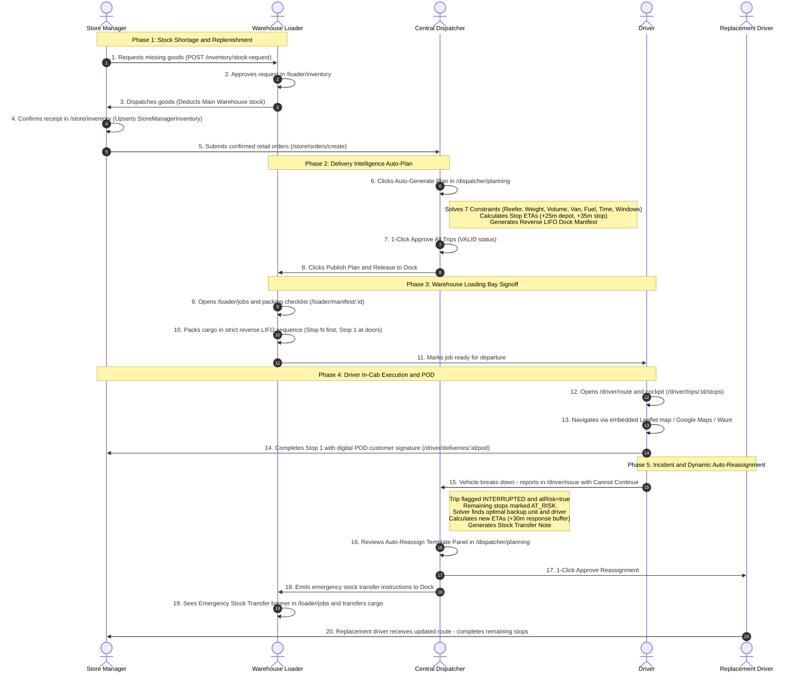

---

### 15.3 Step-by-Step Proof-Testing Script

#### Phase 1: Store Manager Stock Shortage & Replenishment
1. **Login as Store Manager:**
   - **URL:** `http://localhost:5173/login`
   - **Email:** `ishani@waypoint.lk` | **Password:** `12345678`
2. **Inspect Personal Inventory:**
   - Navigate to **"My Inventory"** (`/store/inventory`).
   - Notice the two tabs: **"My Inventory"** (`StoreManagerInventory`) and **"Incoming Stock"**.
3. **Trigger Stock Shortage Request:**
   - Navigate to **"Create Order"** (`/store/orders/create`) or **"Replenishment Plans"** (`/store/replenishment-plans/create`).
   - If an item's required quantity exceeds your available store stock, the form automatically calculates the shortage.
   - Click **"Request Stock Shortage"** (`POST /api/v1/inventory/stock-request`).
   - Request is recorded with status `REQUESTED`.
4. **Login as Warehouse Loader & Dispatch Goods:**
   - Logout and login as `loader@waypoint.lk` | **Password:** `12345678`.
   - Navigate to **"Inventory Management"** (`/loader/inventory`).
   - Switch to the **"Store Manager Stock Requests"** tab.
   - Locate the pending request (`REQUESTED`), click **"Approve"** (`APPROVED`).
   - Click **"Mark as Sent (Deduct Main Stock)"** (`SENT`).
   - *Verification:* Master warehouse quantity (`InventoryItem`) is deducted immediately.
5. **Confirm Receipt as Store Manager:**
   - Logout and login back as `ishani@waypoint.lk`.
   - Go to `/store/inventory` ➔ **"Incoming Stock"** tab.
   - Locate the `SENT` stock request with the active green button: **"Confirm Received"**.
   - Click **"Confirm Received"** (`PUT /api/v1/inventory/stock-requests/:id/receive`).
   - *Verification:* Item quantity is immediately upserted into the "My Inventory" tab.
6. **Create Orders via Plan-Based Generation OR Manual Ad-Hoc:**
   - **Method A: Plan-Based Order Generation (Bulk Outlet Dispatch):**
     - Navigate to **"Replenishment Plans"** (`/store/replenishment-plans`).
     - On any active plan card, click **"⚡ Generate Orders"**.
     - Choose target delivery date (defaults to tomorrow's operating run).
     - Notice the live 16:00 Colombo Cutoff indicator.
     - Click **"⚡ Generate & Queue for Dispatch"** (`POST /api/v1/store/replenishment-plans/:id/generate-orders`).
     - *Verification:* Confirmed orders are created for all assigned outlets in the plan, items are deducted from store inventory, and orders are queued in the Central Dispatcher Orders Queue.
   - **Method B: Manual Ad-Hoc Outlet Order:**
     - Navigate to **"Create Order"** (`/store/orders/create`) ➔ **"1. Create Retail Dispatch Order"** tab.
     - Select target retail outlet (e.g. `Kandy City Center - Keells Super`). Brand and dock requirements populate automatically.
     - *(Optional)* Choose a plan from **"Quick-Fill from Plan"** to auto-populate item quantities in 1 click.
     - Adjust quantities within your available store inventory. Live payload (units, kg, m³) updates dynamically.
     - Review the 16:00 Colombo Cutoff Banner (before 16:00 = Current Cycle; after 16:00 = Next Cycle).
     - Click **"Confirm & Dispatch Retail Order"** (`POST /api/v1/orders`).
     - Order is confirmed and transmitted to the Central Dispatcher queue.
7. **Simulate 16:00 Colombo Cutoff Scenarios:**
   - In the Topbar, click the Colombo Clock widget (`[SIM]` / Live).
   - Click **"🌙 16:30 (Post)"** to test post-cutoff rollover.
   - Place an order for tomorrow. Notice the badge updates to **"⏰ Post-Cutoff (Next Cycle)"** and the order is reserved for the subsequent operating run.
   - Click **"☀️ 14:00 (Pre)"** to return to pre-cutoff mode.

---

#### Phase 2: Central Dispatcher Auto-Plan Generation
1. **Login as Central Dispatcher:**
   - **URL:** `http://localhost:5173/login`
   - **Email:** `luqmandispatcher@gmail.com` | **Password:** `12345678`
2. **Review Incoming Orders:**
   - Navigate to **"Orders Queue"** (`/dispatcher/orders`).
   - Verify all confirmed retail orders are listed with depot, district, brand, temperature requirement, weight, and volume.
3. **Execute Auto-Plan Solver:**
   - Navigate to **"Delivery Planning"** (`/dispatcher/planning`).
   - In Stage 1 ("Select Operating Plan"), click the prominent button: **"✨ Auto-Generate Plan (Delivery Intelligence)"**.
   - The solver executes automatically:
     - Groups orders by Depot (`Peliyagoda DC` vs `Kandy Hub`), District, Brand (`Fresh`, `Style`, `Tech`), and Temperature (`Ambient` vs `Chilled`).
     - Validates **7 Hard Feasibility Constraints**:
       1. Reefer constraint (chilled cargo only assigned to reefer vehicles).
       2. Weight payload capacity (`orderWeightKg <= vehicle.weightCapKg`).
       3. Volume payload capacity (`orderVolumeM3 <= vehicle.volumeCapM3`).
       4. Outlet dock constraint (`van_only` parking requires van vehicle type).
       5. Vehicle weekly fuel quota.
       6. Driver daily time budget (max 2 runs/day).
       7. Departure delivery windows (Pre-dawn Fresh at 04:30 AM / 270 min window; standard daytime runs at 08:30 AM / 480 min window).
     - Calculates arrival ETAs (+25m initial transit from depot, +35m per stop).
     - Synthesizes the Reverse LIFO Dock Loading List (innermost Stop N = Position 1, door Stop 1 = Position N).
     - Auto-defers excess low-priority orders if capacity is exceeded (consecutively skipped orders receive highest priority; deferrals logged to `/dispatcher/deferrals`).
4. **Review & Batch Approval:**
   - In Stage 2 ("Review Formed Runs"), inspect the trip cards:
     - Note the **"✨ Auto-assigned"** badge.
     - Note the green **"VALID"** status badge.
     - Read the **"Explainable Solver Rationale"** card on each trip.
     - Click **"View Reverse LIFO Dock Loading Sequence"** to verify the inverted loading order.
   - Click **"Approve All Trips (1-Click)"** (`POST /api/v1/plans/:id/approve-all`).
   - Click **"Publish Plan & Release to Dock"** in Stage 3.
   - Trips are published and pushed automatically to the Loader and Driver portals.

---

#### Phase 3: Warehouse Loader Vehicle Packing (LIFO)
1. **Login as Warehouse Loader:**
   - **Email:** `loader@waypoint.lk` | **Password:** `12345678`
2. **Inspect Loading Queue:**
   - Navigate to `/loader/jobs` (also accessible via `/loader/trips` and `/loader/manifest`).
   - The newly published trip appears with assigned vehicle, driver, and consignment count.
3. **Execute Reverse LIFO Packing Checklist:**
   - Click **"Start Loading"** or **"Open Checklist"** (`/loader/jobs/:jobId`).
   - Note the **"LIFO Loading Principle Active"** indicator:
     - The items are sequenced in reverse delivery order.
     - The final customer stop is loaded innermost in the truck body.
     - Stop 1 (first destination) is loaded nearest the rear cargo doors.
   - Toggle each item as `LOADED`.
   - Click **"Mark Ready for Departure"** (`READY_FOR_DEPARTURE`).

---

#### Phase 4: Driver In-Cab Navigation & Digital POD
1. **Login as Driver:**
   - **Email:** `luqmandriver@gmail.com` | **Password:** `12345678`
2. **Review Assigned Run:**
   - Go to **"Today Route"** (`/driver/route`).
   - Notice the assigned trip card with scheduled departure, route sequence, and total stops.
   - Click **"Preview Route Map"** to preview the full route circuit on Leaflet.
   - Click **"Start Run / Open In-Cab Cockpit"** (`/driver/trips/:tripId/stops`).
3. **In-Cab Execution Cockpit:**
   - **Cockpit View:** Displays live distance and driving ETA (Haversine formula from driver GPS to destination).
   - **Turn-by-Turn Navigation:** 1-tap Google Maps or Waze launcher.
   - **Interactive Map:** Sequenced stop pins (#1, #2, #3), active pulsing halo, and depot pin.
   - Click **"Begin Delivery & Customer Signoff"** (`/driver/deliveries/:deliveryId/pod`).
4. **Digital Proof of Delivery (POD):**
   - Enter recipient name.
   - Sign digitally on the HTML5 touch canvas.
   - Click **"Confirm Delivery & Complete Stop"**.
   - Stop is marked `DELIVERED`, and map pin updates with a green checkmark (`✓`).

---

#### Phase 5: Emergency Vehicle Breakdown & Dynamic Auto-Reassignment
1. **Trigger Incident as Driver:**
   - While on route, go to `/driver/issue` (or `/driver/deliveries/:deliveryId/incident`).
   - Select Issue Type: `VEHICLE_BREAKDOWN` (or `ACCIDENT`, `REEFER_FAILURE`).
   - Set Severity: `CRITICAL`.
   - Check the toggle: **"⚠️ Cannot Continue - Request Emergency Vehicle Reassignment"**.
   - Enter description: "Transmission failure on A1 highway near Kadugannawa."
   - Click **"Submit Incident Report"**.
   - *Backend automatically:*
     - Sets trip status to `INTERRUPTED` and `atRisk = true`.
     - Flags all remaining uncompleted stops as `AT_RISK` (`isAtRisk = true`).
     - Searches fleet registry for optimal replacement vehicle (same depot, temperature type, sufficient payload capacity, van constraint, maximum fuel quota).
     - Recalculates remaining stop ETAs (+30 min swap response buffer + 25 min per stop).
     - Generates Stock Transfer Note.
2. **Dispatcher 1-Click Reassignment Approval:**
   - Switch back to Central Dispatcher (`luqmandispatcher@gmail.com`) at `/dispatcher/planning`.
   - The top banner alerts: **"⚠️ Critical Trip At-Risk Alert - Dynamic Reassignment Proposal"**.
   - Shows: Disabled vehicle & breakdown reason, number of remaining retail stops at risk, recommended replacement unit and available driver, and stock transfer note.
   - Click **"Approve Reassignment (1-Click)"** (`POST /api/v1/trips/:tripId/approve-reassignment`).
   - *System updates:*
     - Retires broken-down vehicle to `UNAVAILABLE`.
     - Marks replacement vehicle `ASSIGNED`.
     - Resets remaining stops from `AT_RISK` to `PENDING` with new driver and recalculated ETAs.
     - Keeps already completed stops intact.
     - Updates `LoadingJob` with `isStockTransfer: true` and transfer note.
3. **Warehouse Loader Emergency Dock Notification:**
   - Switch to Warehouse Loader (`loader@waypoint.lk`) at `/loader/jobs`.
   - The loading job card prominently displays: **"🔄 Emergency Stock Transfer"** with the dock transfer note.
   - Inside `/loader/jobs/:jobId`, the yellow warning strip instructs loaders to verify cargo transfer from the disabled vehicle to the backup vehicle before departure signoff.
4. **Replacement Driver Route Hand-off:**
   - The replacement driver's `/driver/route` console receives the route update automatically.
   - The new driver completes the remaining deliveries without delay.

---

#### Phase 6: System Governance & Fleet Management
1. **Login as Administrator:**
   - **URL:** `http://localhost:5173/login`
   - **Email:** `admin@waypoint.lk` | **Password:** `Waypoint2026`
2. **Fleet Registry & CDL Compliance:**
   - Navigate to **"Depots & Fleet Hub"** (`/admin/depots`).
   - Inspect vehicles, temperature ratings (`ambient` vs `reefer`), vehicle types (`truck`, `van`), payload capacities, and weekly fuel quotas.
   - Navigate to **"Personnel & Roles"** (`/admin/users`).
   - Inspect driver CDL license numbers, categories, expiry status (`VALID`, `EXPIRING_SOON`, `EXPIRED`), and emergency contact details.
3. **Audit Trail:**
   - Navigate to **"Governance & Audit"** (`/admin/audit`).
   - Inspect immutable audit records: `PLAN_PUBLISHED`, `ROUTE_REASSIGNED` (with logged override reasons), `RECEIPT_CONFIRMED`, `ISSUE_REPORTED`.

---

### 15.4 Pre-Push Validation Checklist & Expected Invariants

Run the following checks before pushing code to `main`:
```bash
# 1. Backend Syntax & Initialization Test
cd backend
node -e "require('./src/app')"

# 2. Schema, Invariant & Unit Test Suite
npm test

# 3. Frontend Production Build Check
cd ../frontend
npm run build
```

#### Expected Invariants:
- [x] **Zero build errors or unhandled bundle warnings.**
- [x] **LIFO loading list** is the exact reverse of delivery stop sequence (Stop N innermost = Position 1; Stop 1 doors = Position N).
- [x] **Pre-dawn Fresh deliveries** depart at `04:30 AM` (270 min window); standard daytime runs depart at `08:30 AM` (480 min window).
- [x] **Reefer orders** are never placed on ambient vehicles.
- [x] **Breakdowns retain already delivered stops** while resetting remaining stops to replacement vehicle.
- [x] **Stock requests strictly segregate** master depot inventory from Store Manager personal inventory.

---

## 16. Quickstart & Demo Accounts

### Prerequisites
- Node.js (v18 or higher)
- npm or yarn

### 1. Backend Setup
```bash
cd backend
npm install
npm run seed  # Seed outlets, vehicles, and demo users
npm run dev
```
Backend runs at `http://localhost:5000` with health check at `http://localhost:5000/health`.

### 2. Frontend Setup
```bash
cd frontend
npm install
npm run dev
```
Frontend runs at `http://localhost:5173`.

### 🧪 Automated Tests
```bash
cd backend
npm test
```
Validates the 10-rule constraint engine, auth middleware, and allocation logic across unit and integration test suites.
